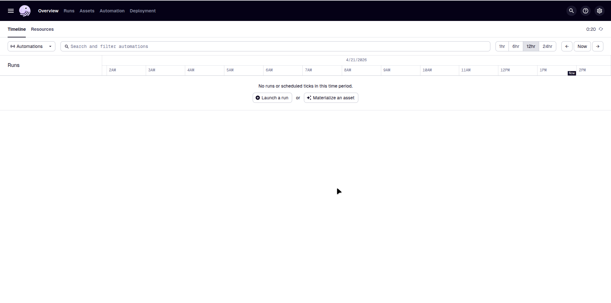
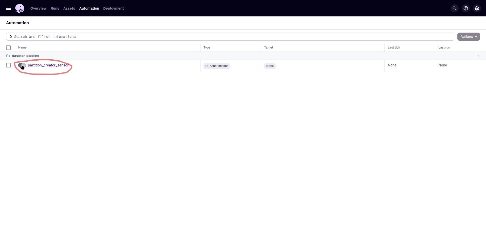
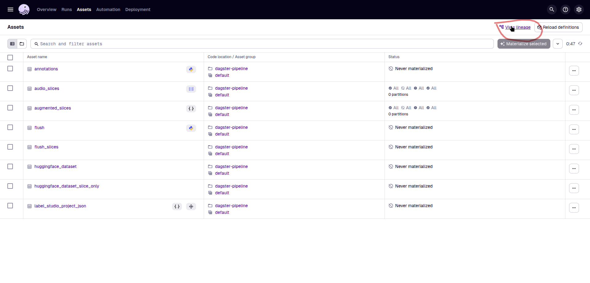
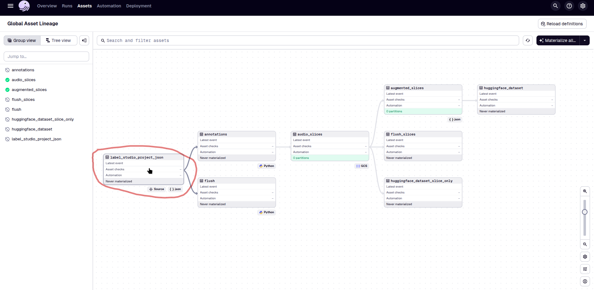
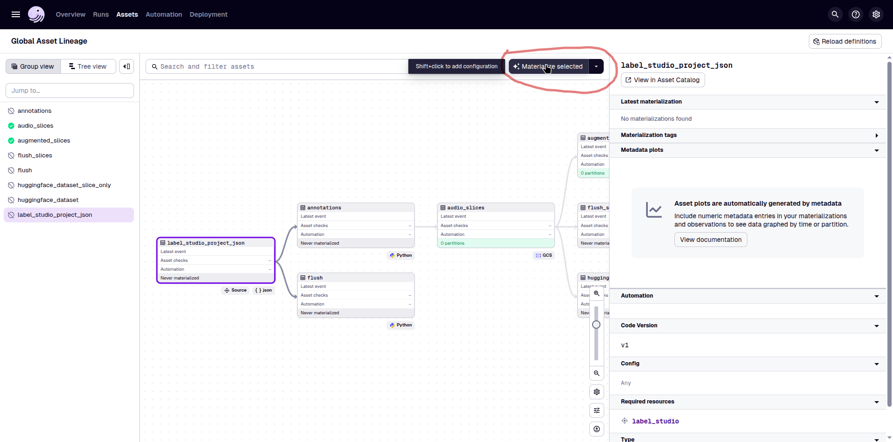

# Dagster Pipeline — Développement local

Un projet de pipeline de données Dagster exécutable en local, géré avec [`uv`](https://docs.astral.sh/uv/).

---

## Prérequis

Avant de commencer, assurez-vous que les outils suivants sont installés sur votre machine :

| Outil | Version | Installation |
|-------|---------|--------------|
| Python | ≥ 3.9 | [python.org](https://www.python.org/downloads/) |
| uv | dernière | `curl -LsSf https://astral.sh/uv/install.sh \| sh` |

> **Utilisateurs Windows** : installez `uv` via PowerShell :
> ```powershell
> powershell -ExecutionPolicy ByPass -c "irm https://astral.sh/uv/install.ps1 | iex"
> ```

---

## Structure du projet

```.
├── pyproject.toml
├── src
│   └── dagster_tutorial
│       ├── definitions.py
│       ├── defs
│       │   ├── extraction
│       │   ├── loading
│       │   ├── resources.py
│       │   └── transformation
│       └── __init__.py
├── tests
└── uv.lock
```

---

## Installation

### 1. Cloner le dépôt

```bash
git clone <repo-en-cours>
cd <nom-du-repo>
```

### 2. Créer et activer un environnement virtuel

```bash
uv venv
source .venv/bin/activate       # Linux / macOS
.venv\Scripts\activate          # Windows
```

### 3. Installer les dépendances

```bash
uv sync
```

> Installe toutes les dépendances depuis `uv.lock`, y compris Dagster et les paquets spécifiques au pipeline.

---

## Lancer Dagster en local
 
### Étape 1 — Démarrer l'interface Dagster (Dagit)
 
```bash
dagster dev
```
 
Lance l'interface web Dagster sur **[http://localhost:3000](http://localhost:3000)**.
 
> `dagster dev` découvre automatiquement les assets et jobs définis dans le workspace. Pour cibler un module spécifique :
> ```bash
> dagster dev -m <votre_pipeline>
> ```
 
### Étape 2 — Accéder à l'interface web
 
Ouvrez votre navigateur sur [http://localhost:3000](http://localhost:3000). Vous devriez voir le tableau de bord Dagster.
 

*Vue principale de l'interface Dagster avec le catalogue d'assets.*
 
### Étape 3 — Naviguer vers le catalogue d'automation
 
Dans la barre de navigation, cliquez sur **Automation** et puis activez **partition_creator_sensor**, il s'agit d'un https://docs.dagster.io/guides/automate/sensors qui vérifie si un asset a été materialisé afin d'executer un job, c'est la fonction `partition_creator_sensor` dans notre cas.
 


### Étape 4 — Naviguer vers le catalogue d'assets
 
Dans la barre de navigation, cliquez sur **Assets** et puis sur **View lineage** pour accéder au graphe de vos assets et visualiser les dépendances entre eux.
 

*Vue du catalogue d'assets.*
 
 
### Étape 5 — Materialiser les assets
 
Cliquez sur l'asset a materialiser pour voir les détails.
 

*Vue du catalogue d'assets avec le graphe de dépendances.*

Cliquez sur **Materialize selected** matérialiser l'asset.


---

## Variables d'environnement

Copiez le fichier `.env.example` pour créez un fichier `.env` à la racine du projet pour les secrets et la configuration locale :

```env
LABEL_STUDIO_HOST_URL="https://label-studio.tia.arkeup.com"
LABEL_STUDIO_LEGACY_TOKEN=a recuperer dans labelstudio : Photo de Profil > Account & Settings> Legacy Token
LABEL_STUDIO_PROJECT_ID=13 (defini par l'URL : https://label-studio.tia.arkeup.com/projects/13/...)

GOOGLE_APPLICATION_CREDENTIALS=keys/sa-gcs-691.json
GCS_BUCKET_NAME=stt-malagasy-2025
GCS_AUDIO_FOLDER_NAME=pamf_1994_debug_nw_32
GCS_SLICED_AUDIO_FOLDER_NAME=sliced

HF_TOKEN=<token_huggingface>
HF_DATASET_PATH=<huggingface_dataset_output>
```

> Dagster charge automatiquement le `.env` avec `dagster dev`. Pour un chemin personnalisé, définissez `DAGSTER_HOME` avant le lancement :
> ```bash
> export DAGSTER_HOME=$(pwd)/.dagster
> ```

## Références

- [Documentation Dagster](https://docs.dagster.io)
- [Documentation uv](https://docs.astral.sh/uv/)
- [Guide Dagster + uv](https://docs.dagster.io/guides/dagster/using-uv)